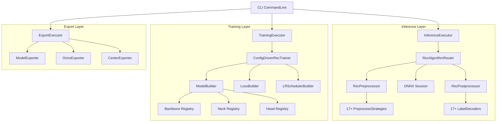

# Rec 模型全量能力对齐实施计划

## 当前状态

已实现:

- 推理: 仅 CTC-greedy 后处理、固定 48x320 输入 (`[src/PaddleOcr.Inference/Onnx/OnnxRunners.cs](src/PaddleOcr.Inference/Onnx/OnnxRunners.cs)`)
- 训练: SimpleRecNet (3层CNN+Linear)、CrossEntropy loss (`[src/PaddleOcr.Training/SimpleRecTrainer.cs](src/PaddleOcr.Training/SimpleRecTrainer.cs)`)
- 导出: 仅文件复制 (`[src/PaddleOcr.Export/NativeExporter.cs](src/PaddleOcr.Export/NativeExporter.cs)`)
- 评估: 仅序列准确率、字符准确率、编辑距离

需要对齐 PaddleOCR tools (`E:\codeding\AI\PaddleOCR-3.3.2\tools\`) 的全部 rec 能力。

## 架构总览




---

## Phase 1: 核心抽象层 (PaddleOcr.Core + PaddleOcr.Models)

**目标**: 定义所有 rec 相关的接口、枚举和基础类型，作为后续所有模块的基础。

### 1.1 Rec 算法枚举和常量

在 `[src/PaddleOcr.Models/](src/PaddleOcr.Models/)` 中新增:

- `**RecAlgorithm.cs`**: 枚举所有 rec 算法
  - `CRNN`, `STARNet`, `RARE`, `SRN`, `NRTR`, `SAR`, `SVTR`, `SVTR_LCNet`, `SVTR_HGNet`, `ViTSTR`, `ABINet`, `SPIN`, `VisionLAN`, `RobustScanner`, `RFL`, `SATRN`, `ParseQ`, `CPPD`, `CAN`, `LaTeXOCR`, `UniMERNet`, `PPFormulaNet`, `PREN`
- `**RecTypes.cs`**: 把分散在各处的 `RecResult`、`RecOnnxOptions`、`RecEvalMetrics` 统一移入 Models 层

### 1.2 推理抽象接口

在 `[src/PaddleOcr.Inference/](src/PaddleOcr.Inference/)` 中新增:

- `**IRecPostprocessor.cs`**: 后处理解码器接口

```csharp
public interface IRecPostprocessor
{
    RecResult Decode(float[] logits, int[] dims, IReadOnlyList<string> charset);
}
```

- `**IRecPreprocessor.cs**`: 预处理策略接口

```csharp
public interface IRecPreprocessor
{
    (float[] data, int[] dims) Process(Image<Rgb24> image, int targetH, int targetW);
}
```

### 1.3 训练抽象接口

在 `[src/PaddleOcr.Training/](src/PaddleOcr.Training/)` 中新增:

- `**IRecBackbone.cs**`: `torch.nn.Module` 子类接口
- `**IRecNeck.cs**`: Neck 组件接口
- `**IRecHead.cs**`: Head 组件接口
- `**IRecLoss.cs**`: 损失函数接口
- `**ILRScheduler.cs**`: 学习率调度器接口

---

## Phase 2: 推理后处理解码器 (17个)

**目标**: 实现 PaddleOCR 所有 rec 后处理解码器，对应 `ppocr/postprocess/rec_postprocess.py`。

在 `src/PaddleOcr.Inference/Postprocessors/` 目录下新增:


| 解码器                  | 对应算法              | 核心逻辑                          |
| -------------------- | ----------------- | ----------------------------- |
| `CtcLabelDecoder`    | CRNN/SVTR/STARNet | argmax + 去重 + 去blank(0)       |
| `AttnLabelDecoder`   | RARE/SPIN         | argmax + 在EOS处截断              |
| `SrnLabelDecoder`    | SRN               | reshape + argmax + 去SOS/EOS   |
| `NrtrLabelDecoder`   | NRTR              | 跳过首token + 在`</s>`截断          |
| `SarLabelDecoder`    | SAR               | argmax + 在BOS/EOS截断 + 可选符号移除  |
| `ViTStrLabelDecoder` | ViTSTR            | 继承NRTR + 跳过首列                 |
| `ABINetLabelDecoder` | ABINet            | 取align输出 + NRTR解码             |
| `SpinLabelDecoder`   | SPIN              | 继承Attn + 不同特殊字符序              |
| `CanLabelDecoder`    | CAN               | 取pred_prob + argmin找结束 + 空格拼接 |
| `LaTeXOcrDecoder`    | LaTeXOCR          | Tokenizer解码 + 后处理             |
| `ParseQLabelDecoder` | ParseQ            | reshape + 在EOS截断              |
| `CppdLabelDecoder`   | CPPD              | 继承NRTR + 处理tuple/dict         |
| `PrenLabelDecoder`   | PREN              | 在EOS(1)截断 + 忽略PAD(0)/UNK(2)   |
| `UniMerNetDecoder`   | UniMERNet         | Tokenizer解码 + 标准化             |
| `VisionLanDecoder`   | VisionLAN         | 长度预测 + 拼接 + 索引偏移              |
| `RflLabelDecoder`    | RFL               | 双模式: 文本解码 / 长度预测              |
| `SatrnLabelDecoder`  | SATRN             | 同SAR逻辑                        |


每个解码器实现 `IRecPostprocessor` 接口，并在 `InferenceComponentRegistry` 中注册。

---

## Phase 3: 推理预处理策略

**目标**: 实现算法特定的图像预处理，对应 `tools/infer/predict_rec.py` 中的 `resize_norm_img` 系列方法。

在 `src/PaddleOcr.Inference/Preprocessors/` 目录下新增:

- `**DefaultRecPreprocessor`**: 标准 resize + normalize (大多数CTC算法)
  - 按宽高比动态计算宽度, padding到目标宽度
- `**NrtrRecPreprocessor`**: 灰度转换 + 特定归一化 (NRTR, ViTSTR)
- `**SarRecPreprocessor`**: 保持宽高比 + valid_ratio 计算 (SAR, RobustScanner)
- `**SrnRecPreprocessor`**: 编码 word_pos, gsrm_word_pos, attention 偏置 (SRN)
- `**CanRecPreprocessor`**: 特殊归一化 + image_mask (CAN)
- `**LaTeXOcrPreprocessor`**: 特殊归一化 + 动态尺寸 (LaTeXOCR)
- `**SpinRecPreprocessor`**: SPIN 特定归一化
- `**VisionLanPreprocessor`**: VisionLAN 特定处理

工厂类 `RecPreprocessorFactory` 根据 `RecAlgorithm` 返回对应预处理器。

---

## Phase 4: 推理集成与 CLI

**目标**: 改造 `RecOnnxRunner` 和 CLI，支持算法选择、批处理、动态图像尺寸。

### 4.1 扩展 RecOnnxOptions

在 `[src/PaddleOcr.Inference/Onnx/OnnxRunners.cs](src/PaddleOcr.Inference/Onnx/OnnxRunners.cs)` 中:

```csharp
public sealed record RecOnnxOptions(
    string ImageDir, string RecModelPath, string OutputDir,
    string? RecCharDictPath, bool UseSpaceChar, float DropScore,
    // 新增
    RecAlgorithm RecAlgorithm,      // 算法选择 (default: SVTR_LCNet)
    string RecImageShape,            // "3,48,320"
    int RecBatchNum,                 // 批处理大小 (default: 6)
    int MaxTextLength,               // 最大文本长度 (default: 25)
    bool RecImageInverse,            // CAN 反转
    bool ReturnWordBox               // 词级别框
);
```

### 4.2 改造 RecOnnxRunner

- 根据 `RecAlgorithm` 选择 `IRecPreprocessor` 和 `IRecPostprocessor`
- 支持批处理: 按 `RecBatchNum` 分批处理图像
- 支持动态图像尺寸: 解析 `RecImageShape` 设置输入尺寸
- 支持特殊输入: SRN/SAR/RobustScanner/CAN 的额外输入张量

### 4.3 CLI 扩展

在 `[src/PaddleOcr.Inference/InferenceExecutor.cs](src/PaddleOcr.Inference/InferenceExecutor.cs)` 的 `RunRec` 方法中新增参数解析:

- `--rec_algorithm` (default: SVTR_LCNet)
- `--rec_image_shape` (default: "3,48,320")
- `--rec_batch_num` (default: 6)
- `--max_text_length` (default: 25)
- `--rec_image_inverse` (default: false)
- `--return_word_box` (default: false)

---

## Phase 5: 训练网络组件 (TorchSharp)

**目标**: 在 TorchSharp 中实现 PaddleOCR 的 rec 模型架构组件，对应 `ppocr/modeling/` 下的 backbones/necks/heads。

### 5.1 Backbone 实现

在 `src/PaddleOcr.Training/Backbones/` 目录下:

- `**MobileNetV1Enhance`**: 深度可分离卷积 + SE模块 + 非对称步长(2,1)
- `**PPHGNetSmall`**: HG_Block + ESE模块 + 自适应池化[1,40]
- `**SVTRNet`**: Local/Global 混合注意力 + ConvMixer
- `**ResNet31/32/45`**: 用于 SAR/SATRN/NRTR
- `**ViTSTR`**: Vision Transformer backbone
- `**MTB`**: NRTR 的 Multi-Task Backbone
- `**DenseNet`**: 用于 VisionLAN
- `**EfficientNetB3`**: 用于 PREN
- 其余: `PPHGNetV2`, `SVTRv2`, `RepSVTR`, `ShallowCNN`, `PPLCNetV3`, `MicroNet` 等

### 5.2 Neck 实现

在 `src/PaddleOcr.Training/Necks/` 目录下:

- `**SequenceEncoder**`: 核心 Neck，包含:
  - `Im2Seq`: reshape `[B,C,1,W]` -> `[B,W,C]`
  - `EncoderWithRNN`: 双向 LSTM
  - `EncoderWithFC`: Linear 投影
  - `EncoderWithSVTR`: SVTR blocks
  - `EncoderWithCascadeRNN`: 多层双向 LSTM

### 5.3 Head 实现

在 `src/PaddleOcr.Training/Heads/` 目录下:

- `**CTCHead**`: Linear -> vocab_size, 可选2层FC
- `**AttentionHead**`: GRU/LSTM attention cell
- `**SARHead**`: SAREncoder + ParallelSARDecoder (2D attention)
- `**NRTRHead` (Transformer)**: Encoder-Decoder Transformer + 位置编码
- `**SRNHead`**: PVAM + GSRM + VSFD
- `**MultiHead`**: CTC + SAR/NRTR 组合
- 其余: `ABINetHead`, `VLHead`, `RFLHead`, `CANHead`, `LaTeXOCRHead`, `SATRNHead`, `ParseQHead`, `CPPDHead`, `PRENHead`, `RobustScannerHead`, `SPINAttentionHead`, `UniMERNetHead`, `PPFormulaNetHead`

### 5.4 组件注册工厂

- `**RecModelBuilder.cs`**: 从 YAML config 构建完整模型
  - `BuildBackbone(config)` -> `torch.nn.Module`
  - `BuildNeck(config)` -> `torch.nn.Module`
  - `BuildHead(config)` -> `torch.nn.Module`
  - `BuildModel(config)` -> 组合 Backbone + Neck + Head

---

## Phase 6: 训练损失函数

**目标**: 实现所有 rec 相关损失函数，对应 `ppocr/losses/` 下的 rec 损失。

在 `src/PaddleOcr.Training/Losses/` 目录下:

- `**CTCLoss`**: 真正的 CTC Loss (TorchSharp 内置 `ctc_loss`)
- `**AttentionLoss`**: CrossEntropy 用于 attention 解码
- `**SARLoss`**: CrossEntropy + ignore_index
- `**NRTRLoss`**: CrossEntropy + label smoothing + padding mask
- `**SRNLoss`**: SRN 专用损失
- `**MultiLoss`**: 加权组合 CTC + SAR/NRTR
- 其余: `AsterLoss`, `PRENLoss`, `VLLoss`, `SPINAttentionLoss`, `RFLLoss`, `CANLoss`, `SATRNLoss`, `ParseQLoss`, `CPPDLoss`, `LaTeXOCRLoss`, `UniMERNetLoss`, `PPFormulaNetLoss`, `EnhancedCTCLoss`
- `**RecLossBuilder`**: 工厂类，从 config 构建损失

---

## Phase 7: 训练基础设施

**目标**: 实现高级训练特性，对应 `tools/program.py` 中的训练循环。

### 7.1 学习率调度器

在 `src/PaddleOcr.Training/Schedulers/` 目录下:

- `**PiecewiseDecay`**: 分段衰减
- `**CosineAnnealingDecay`**: 余弦退火
- `**LinearWarmupCosine`**: 线性预热 + 余弦退火
- `**PolynomialDecay`**: 多项式衰减
- `**LRSchedulerBuilder`**: 工厂类

### 7.2 训练增强特性

在 `src/PaddleOcr.Training/` 中:

- `**AmpTrainingHelper.cs`**: 混合精度训练 (TorchSharp AMP)
- `**ModelAverager.cs`**: 模型参数平均 (SRN)
- `**DistillationTrainer.cs`**: 蒸馏训练支持
- `**GradientUtils.cs**`: 梯度裁剪、梯度累积

### 7.3 数据增强和数据集

在 `src/PaddleOcr.Data/` 中:

- `**RecAugmentation.cs**`: Rec 数据增强 (旋转、噪声、模糊等)
- `**MultiScaleDataSet.cs**`: 多尺度数据集
- `**LabelEncoders/**`: CTCLabelEncode, SARLabelEncode, NRTRLabelEncode 等

---

## Phase 8: 训练集成 - ConfigDrivenRecTrainer

**目标**: 用配置驱动的训练器替换 `SimpleRecTrainer`，对应 `tools/train.py` + `tools/program.py`。

### 8.1 新增 ConfigDrivenRecTrainer

在 `[src/PaddleOcr.Training/](src/PaddleOcr.Training/)` 中:

- `**ConfigDrivenRecTrainer.cs`**: 
  - 从 YAML config 构建完整模型 (Backbone + Neck + Head)
  - 从 config 构建损失函数和优化器
  - 从 config 构建 LR 调度器
  - 完整训练循环: 前向 -> 损失 -> 反向 -> 优化 -> 评估 -> 保存
  - 支持 MultiHead 训练 (char_num 配置)
  - 支持 AMP、梯度裁剪、模型平均
  - 支持 checkpoint resume
  - 保留 `SimpleRecTrainer` 作为向后兼容

### 8.2 修改 TrainingExecutor

在 `[src/PaddleOcr.Training/TrainingExecutor.cs](src/PaddleOcr.Training/TrainingExecutor.cs)` 中:

- 检测 config 中的模型架构配置
- 如有完整架构配置 -> 使用 `ConfigDrivenRecTrainer`
- 否则 -> 回退到 `SimpleRecTrainer`

---

## Phase 9: 导出能力增强

**目标**: 增强导出能力，对应 `tools/export_model.py`、`tools/export_to_onnx.py`、`tools/export_center.py`。

### 9.1 模型导出增强

在 `[src/PaddleOcr.Export/](src/PaddleOcr.Export/)` 中:

- `**ModelExporter.cs`** (增强):
  - 从 TorchSharp 模型导出推理格式 (TorchScript/ONNX)
  - 动态图到静态图转换
  - 嵌入字典和预处理配置到 manifest

### 9.2 ONNX 导出增强

- `**OnnxModelExporter.cs`**:
  - 从 TorchSharp 训练模型直接导出 ONNX
  - 设置正确的输入/输出名称和尺寸
  - 支持动态 batch 和序列长度

### 9.3 Center 导出

- `**CenterExporter.cs`**:
  - 从训练数据提取字符特征中心
  - 遍历训练集 -> 模型前向(return_feats=True) -> 后处理
  - 按正确预测聚合特征 -> 计算均值中心
  - 保存到 `train_center.pkl` (或 .NET 等效格式)

### 9.4 JSON to pdmodel 转换增强

- 增强 `convert json2pdmodel` 命令的实际转换逻辑

---

## Phase 10: 评估能力增强

**目标**: 增强评估指标，对应 `tools/eval.py` + `tools/program.py`。

在 `[src/PaddleOcr.Training/](src/PaddleOcr.Training/)` 中:

- `**RecMetrics.cs`** (新增):
  - BLEU score (用于 LaTeXOCR, UniMERNet, PP-FormulaNet)
  - Exp rate / Express match rate (公式模型)
  - Per-character accuracy breakdown
  - 替换/插入/删除 错误分析
  - 混淆矩阵

在评估流程中根据算法类型自动选择合适的指标组合。

---

## 文件变更汇总

### 新增文件 (~80+ 文件)

- `src/PaddleOcr.Models/`: RecAlgorithm.cs, RecTypes.cs (~2 files)
- `src/PaddleOcr.Inference/Postprocessors/`: 17 个解码器 + 基类 (~18 files)
- `src/PaddleOcr.Inference/Preprocessors/`: 8 个预处理器 + 工厂 (~9 files)
- `src/PaddleOcr.Training/Backbones/`: ~15 backbone 实现
- `src/PaddleOcr.Training/Necks/`: ~5 neck 实现
- `src/PaddleOcr.Training/Heads/`: ~18 head 实现
- `src/PaddleOcr.Training/Losses/`: ~15 loss 实现 + builder
- `src/PaddleOcr.Training/Schedulers/`: ~5 调度器 + builder
- `src/PaddleOcr.Training/`: ConfigDrivenRecTrainer, AmpHelper, ModelAverager, etc. (~5 files)
- `src/PaddleOcr.Export/`: CenterExporter, OnnxModelExporter (~2 files)
- `src/PaddleOcr.Data/`: RecAugmentation, MultiScaleDataSet, LabelEncoders (~5 files)

### 修改文件 (~10 files)

- `src/PaddleOcr.Inference/Onnx/OnnxRunners.cs` - RecOnnxRunner 改造
- `src/PaddleOcr.Inference/Onnx/InferenceComponentRegistry.cs` - 注册所有解码器
- `src/PaddleOcr.Inference/InferenceExecutor.cs` - CLI 参数扩展
- `src/PaddleOcr.Training/TrainingExecutor.cs` - 训练器路由
- `src/PaddleOcr.Export/ExportExecutor.cs` - 导出命令增强
- `src/PaddleOcr.Export/NativeExporter.cs` - 导出逻辑增强
- 各 .csproj 文件 - 新增文件引用

---

## 实施顺序 (遵循底层优先原则)

按照"先实现最底层的代码再去实现引用代码"的原则，严格按以下顺序:

1. Phase 1 -> Phase 2 -> Phase 3 -> Phase 4 (推理链路)
2. Phase 5 -> Phase 6 -> Phase 7 -> Phase 8 (训练链路)
3. Phase 9 (导出)
4. Phase 10 (评估)

